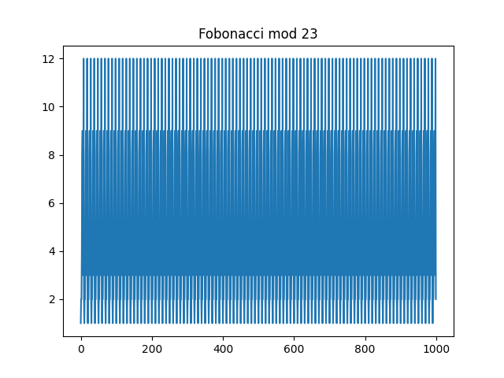
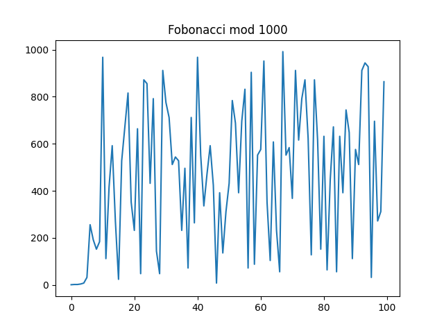

# Fobonacci Sequence

I was curious what the following formula looked like on a graph:

```
f(0) = 1
f(1) = 2
f(n) = f(n-1) * f(n-2) % k
```

For varying values of `k`. As such, I did so.

## Results

| `k` Value | Graph                            | Notes                                                                                                                                                            |
| --------- | -------------------------------- | ---------------------------------------------------------------------------------------------------------------------------------------------------------------- |
| 2         |     | As expected, all values are divisible by 2.                                                                                                                      |
| 5         |     | You can't particularly make out much from this graph due to the oscillatory nature.                                                                              |
| 23        |    | This is a similar oscillation, but interestingly, an iterative pattern emerges.                                                                                  |
| 32        |    | The divisibility with powers of 2 increases significantly.                                                                                                       |
| 64        |    | Similarly, divisibility with higher powers of 2 also shows up.                                                                                                   |
| 1000      |  | This one is fairly interesting - This looks like fairly pseudo-random data, and could be used (potentially) for non-cryptographic random number generation work. |
| 2300      |  | This graph demonstrates how poor this function is from a PRNG perspective. Interesting, nonetheless.                                                             |

# License TL;DR

This project is distributed under the MIT license. This is a paraphrasing of a
[short summary](https://tldrlegal.com/license/mit-license).

This license is a short, permissive software license. Basically, you can do
whatever you want with this software, as long as you include the original
copyright and license notice in any copy of this software/source.

## What you CAN do:

-   You may commercially use this project in any way, and profit off it or the
    code included in any way;
-   You may modify or make changes to this project in any way;
-   You may distribute this project, the compiled code, or its source in any
    way;
-   You may incorporate this work into something that has a more restrictive
    license in any way;
-   And you may use the work for private use.

## What you CANNOT do:

-   You may not hold me (the author) liable for anything that happens to this
    code as well as anything that this code accomplishes. The work is provided
    as-is.

## What you MUST do:

-   You must include the copyright notice in all copies or substantial uses of
    the work;
-   You must include the license notice in all copies or substantial uses of the
    work.

If you're feeling generous, give credit to me somewhere in your projects.
